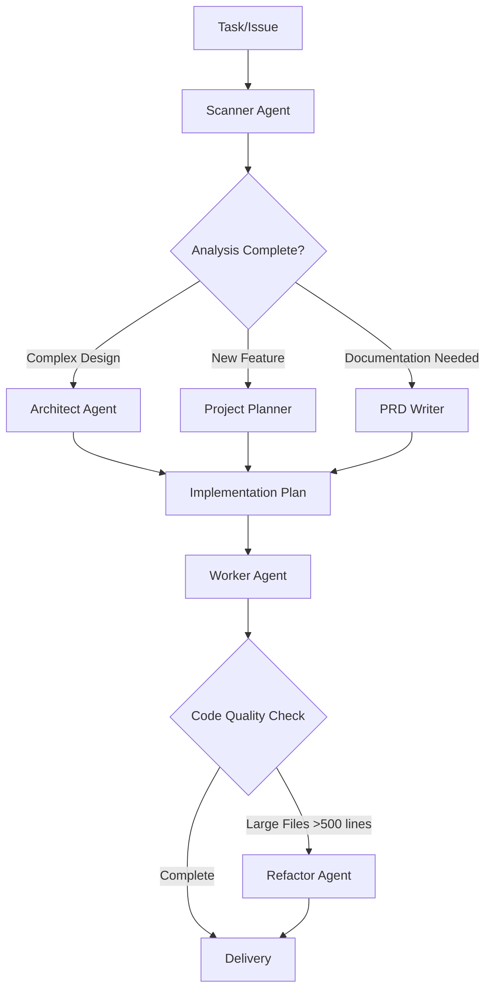

# Claude Agents Collection

A comprehensive collection of specialized Claude AI agent configurations designed to streamline and optimize software development workflows. Each agent serves a distinct role in the development process, following SOLID principles, KISS philosophy, and Occam's razor to maintain simplicity and effectiveness.

## Overview

This project provides six specialized Claude agents that work together to create a complete software development ecosystem:

- **Scanner** - Information gathering and analysis
- **Architect** - Systems design and architecture
- **Project Planner** - Strategic planning and task coordination
- **PRD Writer** - Product requirements documentation
- **Worker** - Implementation and execution
- **Refactor** - Code optimization and modularization

## Agent Profiles

### 🔍 Scanner Agent

- **Model**: Sonnet
- **Color**: Blue
- **Purpose**: Comprehensive, unbiased information gathering and analysis
- **Capabilities**:
  - Systematic codebase reconnaissance
  - Pattern recognition and documentation
  - Context discovery and mapping
  - Raw data collection without interpretation
  - Gap identification in implementations

**When to Use**: Before making any major decisions, understanding complex bugs, or analyzing existing architectures.

### 🏗️ Architect Agent

- **Model**: Sonnet
- **Color**: Purple
- **Purpose**: Systems architecture and design excellence
- **Capabilities**:
  - Complete component mapping and dependency analysis
  - SOLID/KISS violation identification
  - Architectural decision records (ADR)
  - Performance and scalability assessment
  - Migration and rollout planning

**When to Use**: For design decisions, refactoring planning, or architecture evaluation tasks.

### 📋 Project Planner Agent

- **Model**: Opus
- **Color**: Orange
- **Purpose**: Comprehensive project analysis and strategic planning
- **Capabilities**:
  - Multi-step hierarchical planning
  - Risk assessment and mitigation strategies
  - Technical requirement extraction
  - Implementation phase structuring
  - Worker task delegation

**When to Use**: For new features, complex projects, or when you need strategic implementation roadmaps.

### 📄 PRD Writer Agent

- **Color**: Green
- **Purpose**: Product Requirements Document creation
- **Capabilities**:
  - Business and user goal documentation
  - User persona development
  - Functional requirements specification
  - User story creation with acceptance criteria
  - Technical considerations documentation

**When to Use**: When formalizing product specifications or documenting feature requirements.

### ⚡ Worker Agent

- **Purpose**: Precise implementation and execution
- **Capabilities**:
  - Code implementation following project conventions
  - Quality assurance and testing
  - Error handling and edge case management
  - Documentation updates
  - Validation and verification

**When to Use**: For executing planned solutions, implementing features, or fixing identified issues.

### 🔧 Refactor Agent

- **Color**: Cyan
- **Purpose**: Code optimization and modularization specialist
- **Capabilities**:
  - Large file decomposition (proactive when >500 lines)
  - Logical boundary identification
  - Component extraction and modularization
  - Dead code elimination
  - Interface design and cleanup

**When to Use**: For breaking down monoliths, optimizing large files, or improving code structure.

## Workflow Integration

### Typical Development Flow

### Agent Interaction Patterns

1. **Discovery Phase**: Scanner → (Architect/Planner)
2. **Planning Phase**: (Architect/Planner) → Worker
3. **Implementation Phase**: Worker → (Refactor if needed)
4. **Documentation Phase**: PRD Writer (as needed)

## Usage Guidelines

### Core Principles

All agents follow these foundational principles:

- **SOLID Principles**: Single responsibility, Open/closed, Liskov substitution, Interface segregation, Dependency inversion
- **KISS (Keep It Simple, Stupid)**: "As simple as possible, but not simpler than necessary"
- **Occam's Razor**: Every new entity or abstraction must justify its existence

### Best Practices

1. **Always start with Scanner** for complex or unfamiliar codebases
2. **Use Project Planner** for multi-step features and strategic planning
3. **Architect handles** design decisions and architectural evaluations
4. **PRD Writer** formalizes requirements before development
5. **Worker executes** with precision and quality focus
6. **Refactor proactively** when files exceed 500 lines

### Agent Selection Guide

| Scenario                        | Recommended Agent | Reason                                |
| ------------------------------- | ----------------- | ------------------------------------- |
| Understanding existing codebase | Scanner           | Comprehensive analysis without bias   |
| Planning new feature            | Project Planner   | Strategic multi-step planning         |
| Architecture decisions          | Architect         | Design expertise and SOLID principles |
| Documenting requirements        | PRD Writer        | Structured requirement documentation  |
| Implementing solutions          | Worker            | Precise execution and quality         |
| Large file optimization         | Refactor          | Automatic for >500 lines              |

## Getting Started

1. **Identify your task type** using the agent selection guide
2. **Start with analysis** (Scanner) for complex scenarios
3. **Plan strategically** (Project Planner/Architect) for significant changes
4. **Document requirements** (PRD Writer) for new features
5. **Implement precisely** (Worker) following the plan
6. **Optimize continuously** (Refactor) as code grows

## Agent Tools and Capabilities

Each agent comes with specialized tools optimized for their role:

- **Scanner**: Web browsing, file analysis, comprehensive search capabilities
- **Project Planner**: Full toolkit including browser automation for research
- **Architect**: Quick inventory tools, web search, documentation tools
- **PRD Writer**: Research and writing tools
- **Worker**: Implementation tools (Read, Write, Edit, MultiEdit, Bash)
- **Refactor**: Code analysis and editing tools

## License

This project is released under the GNU General Public License v3.0. See [LICENSE](LICENSE) for details.

---

**Philosophy**: Each agent embodies expertise while maintaining simplicity. Together, they create a powerful development workflow that scales from simple tasks to complex architectural challenges, always prioritizing maintainable, high-quality outcomes.
