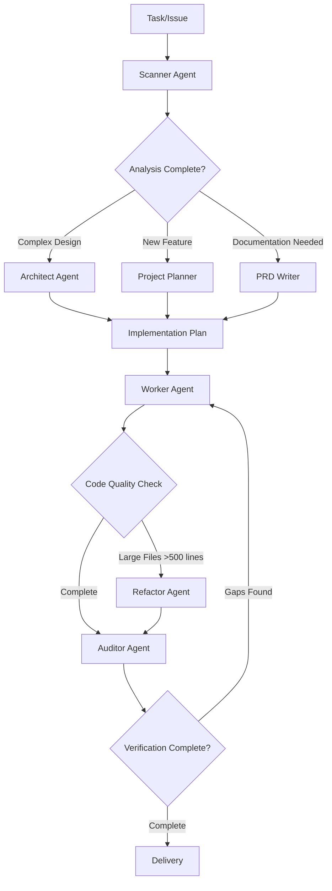
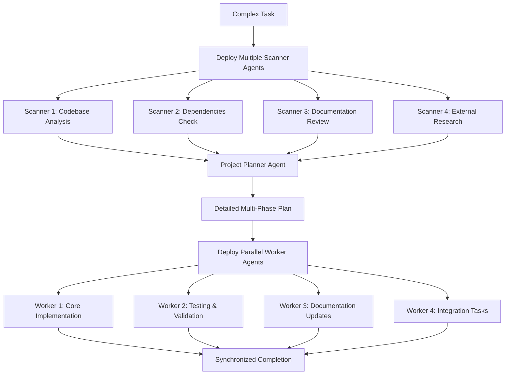

# Claude Agents Collection

A comprehensive collection of specialized Claude AI agent configurations designed to streamline and optimize software development workflows. Each agent serves a distinct role in the development process, following SLON principles, KISS philosophy, and Occam's razor to maintain simplicity and effectiveness.

## Overview

This project provides seven specialized Claude agents that work together to create a complete software development ecosystem:

- **Scanner** - Information gathering and analysis
- **Architect** - Systems design and architecture
- **Project Planner** - Strategic planning and task coordination
- **PRD Writer** - Product requirements documentation
- **Worker** - Implementation and execution
- **Refactor** - Code optimization and modularization
- **Auditor** - Quality verification and completion validation

## Agent Profiles

### 🔍 Scanner Agent

- **Model**: Sonnet
- **Color**: Blue
- **Purpose**: Comprehensive, unbiased information gathering and analysis
- **Capabilities**:
  - Systematic codebase reconnaissance
  - Pattern recognition and documentation
  - Context discovery and mapping
  - Raw data collection without interpretation
  - Gap identification in implementations
  - PROJECT_STRUCTURE.md analysis for project-wide issues

**When to Use**: Before making any major decisions, understanding complex bugs, or analyzing existing architectures.

### 🏗️ Architect Agent

- **Model**: Sonnet
- **Color**: Purple
- **Purpose**: Systems architecture and design excellence
- **Capabilities**:
  - Complete component mapping and dependency analysis
  - SLON/KISS violation identification
  - Architectural decision records (ADR)
  - Performance and scalability assessment
  - Migration and rollout planning
  - **ALWAYS ULTRATHINK methodology** for comprehensive analysis
  - Multi-pass design approach (Initial Scan → Simplify → Design → Review)

**When to Use**: For design decisions, refactoring planning, or architecture evaluation tasks.

### 📋 Project Planner Agent

- **Model**: Opus
- **Color**: Orange
- **Purpose**: Comprehensive project analysis and strategic planning
- **Capabilities**:
  - Multi-step hierarchical planning
  - Risk assessment and mitigation strategies
  - Technical requirement extraction
  - Implementation phase structuring
  - Worker task delegation

**When to Use**: For new features, complex projects, or when you need strategic implementation roadmaps.

### 📄 PRD Writer Agent

- **Model**: Sonnet
- **Color**: Green
- **Purpose**: Product Requirements Document creation
- **Capabilities**:
  - Business and user goal documentation
  - User persona development
  - Functional requirements specification
  - User story creation with acceptance criteria
  - Technical considerations documentation

**When to Use**: When formalizing product specifications or documenting feature requirements.

### ⚡ Worker Agent

- **Model**: Sonnet
- **Color**: Yellow
- **Purpose**: Precise implementation and execution
- **Capabilities**:
  - Code implementation following project conventions
  - Quality assurance and testing
  - Error handling and edge case management
  - Documentation updates
  - Validation and verification

**When to Use**: For executing planned solutions, implementing features, or fixing identified issues.

### 🔧 Refactor Agent

- **Model**: Sonnet
- **Color**: Cyan
- **Purpose**: Code optimization and modularization specialist
- **Capabilities**:
  - **PROACTIVE large file decomposition when files exceed 500 lines**
  - Logical boundary identification
  - Component extraction and modularization
  - Dead code elimination
  - Interface design and cleanup
  - Monolith slaying methodology with systematic analysis and execution

**When to Use**: For breaking down monoliths, optimizing large files, or improving code structure.

### ✅ Auditor Agent

- **Model**: Sonnet
- **Color**: Pink
- **Purpose**: Comprehensive task completion verification and quality assurance
- **Capabilities**:
  - Complete requirement verification against original specifications
  - End-to-end solution validation
  - Quality assessment using SLON, KISS, and Occam's razor principles
  - Gap analysis and missing functionality identification
  - Production-readiness evaluation

**When to Use**: To verify task completion, validate implementations meet all requirements, or confirm production readiness.

## Workflow Integration

### Typical Development Flow

### Agent Interaction Patterns

1. **Discovery Phase**: Scanner → (Architect/Planner)
2. **Planning Phase**: (Architect/Planner) → Worker
3. **Implementation Phase**: Worker → (Refactor if needed)
4. **Quality Verification Phase**: Auditor → (Worker if gaps found)
5. **Documentation Phase**: PRD Writer (as needed)

## ULTRATHINK Methodology

ULTRATHINK is an advanced multi-agent coordination approach that maximizes parallel processing and comprehensive analysis through simultaneous agent deployment.

### USAGE EXAMPLE

First of all, use multiple, simultaneous scanner subagents to search, analyze, collect and extract information from code and the internet
Scondly, use project-planner subagent for thorough planning, creating step-by-step plans, with maximum details and phases
Finally, use multiple, simultaneous, parallel worker subagents to execute the plan  
ULTRATHINK
{USER_PROMPT}

### Practical Implementation

### Best Practices for Multi-Agent Coordination

#### 1. **Information Gathering Phase**

- Deploy 3-4 scanner agents simultaneously for different aspects
- Assign specific domains: codebase, dependencies, documentation, external research
- Ensure no overlap in scanning responsibilities
- Aggregate findings before planning phase

#### 2. **Strategic Planning Phase**

- Use single Project Planner agent for consistency
- Feed all scanner results into comprehensive analysis
- Request maximum detail level and multi-phase breakdown
- Validate plan completeness before execution

#### 3. **Parallel Execution Phase**

- Deploy multiple worker agents for different plan phases
- Maintain clear separation of concerns between workers
- Implement synchronization points for dependent tasks
- Monitor progress across all parallel streams

#### 4. **Quality Assurance**

- Run Auditor agent after all workers complete
- Validate against original requirements from scanners
- Ensure no gaps in implementation coverage
- Confirm production readiness

#### 5. **Coordination Guidelines**

- **Always start with parallel scanning** for complex tasks
- **Single source of truth** for planning (one Project Planner)
- **Clear task boundaries** for parallel workers
- **Explicit synchronization** points between phases
- **Comprehensive validation** at completion

### When to Use ULTRATHINK

- **Complex, multi-faceted projects** requiring comprehensive analysis
- **Large codebases** with multiple interconnected components
- **Critical implementations** where thoroughness is paramount
- **Cross-domain tasks** involving code, documentation, and external research
- **High-stakes projects** requiring maximum quality assurance

## Usage Guidelines

### Core Principles

All agents follow these foundational principles:

- **SLON Principles**: Strive for Simplicity, Lean solutions, doing One clear thing, and No unnecessary overengineering
- **KISS (Keep It Simple, Stupid)**: "As simple as possible, but not simpler than necessary"
- **Occam's Razor**: Every new entity or abstraction must justify its existence

### Best Practices

1. **Always start with Scanner** for complex or unfamiliar codebases
2. **Use Project Planner** for multi-step features and strategic planning
3. **Architect handles** design decisions and architectural evaluations
4. **PRD Writer** formalizes requirements before development
5. **Worker executes** with precision and quality focus
6. **Refactor PROACTIVELY** when files exceed 500 lines (automatic trigger)

**💡 Need help choosing?** Use the [Decision Trees Guide](DECISION_TREES.md) for detailed selection flowcharts and scenario-based selection matrices.

## Getting Started

1. **Identify your task type** using the [Agent Selection Guide](DECISION_TREES.md)
2. **Document requirements** (PRD Writer) for new features
3. **Implement precisely** (Worker) following the plan
4. **Optimize continuously** (Refactor) as code grows
5. **Verify completion** (Auditor) to ensure quality and requirement fulfillment before considering the task finished

## Agent Tools and Capabilities

Each agent comes with specialized tools optimized for their role:

- **Scanner**: 36 tools including Figma API integration, Context7 library access, full Playwright browser automation (25 tools), IDE integration, plus comprehensive file analysis and search capabilities
- **Project Planner**: 5 tools (Read, LS, Grep, Glob, TodoWrite)
- **Architect**: 7 tools focused on quick analysis (Bash, Grep, LS, WebSearch, TodoWrite, NotebookRead, Glob) for architectural assessment and documentation
- **PRD Writer**: 8 tools for research and documentation (Task, Bash, Grep, LS, Read, Write, WebSearch, Glob)
- **Worker**: 9 implementation-focused tools (Read, Write, Edit, MultiEdit, Bash, Grep, Glob, LS, TodoWrite) for precise code execution
- **Refactor**: 7 specialized tools (Read, Edit, Bash, Grep, Glob, LS, TodoWrite)
- **Auditor**: 7 comprehensive verification tools (Read, Grep, Glob, LS, Bash, mcp__ide__getDiagnostics, TodoWrite)

## License

This project is released under the GNU General Public License v3.0. See [LICENSE](LICENSE) for details.

---

**Philosophy**: Each agent embodies expertise while maintaining simplicity. Together, they create a powerful development workflow that scales from simple tasks to complex architectural challenges, always prioritizing maintainable, high-quality outcomes.
